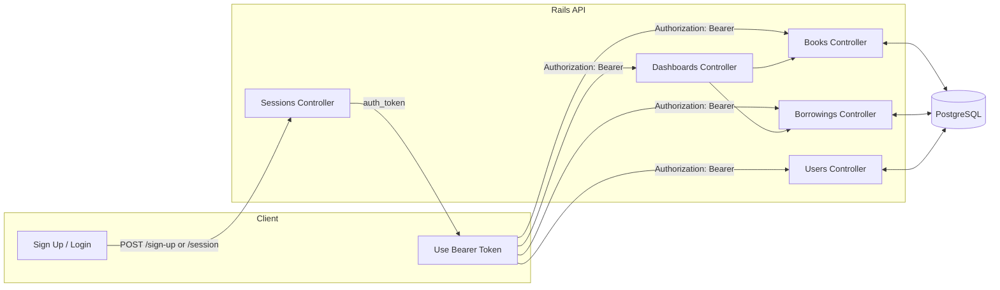
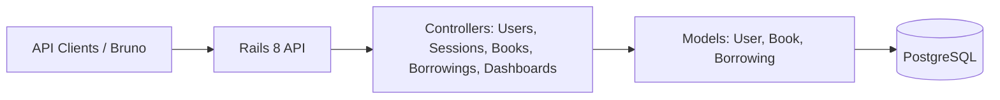
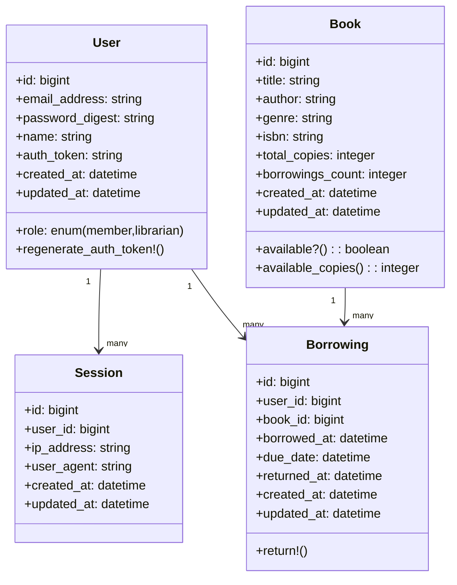
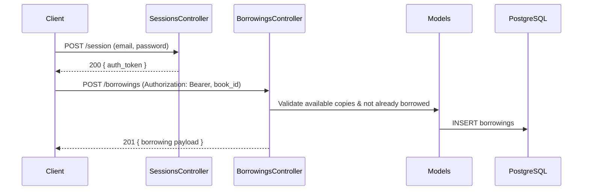

# 📚 Ballast Lane Test – Rails API

A Rails 8 API-only application for a simple library system. It supports users (members and librarians), session-based token auth (Bearer tokens), books CRUD, borrowing/return flows, and role-based dashboards.

## 🧰 Tech stack
- Ruby 3.4.x, Rails 8 (API-only)
- PostgreSQL, Puma, Rack 3
- Auth: token via `Authorization: Bearer <token>`

## 🚀 Quick start
1) Prerequisites
- Ruby 3.4.x (rbenv/rvm)
- PostgreSQL running locally, you can use the following command:

```sh
docker run --rm -it \
  -p 5432:5432 \
  --name test_postgres \
  -e POSTGRES_PASSWORD=test \
  postgres:latest
```

2) Install dependencies
- bundle install

3) Database setup
- bin/rails db:prepare
- Load seed data using fixtures into development:
  - RAILS_ENV=development bin/rails db:fixtures:load

PostgreSQL setup (local or Docker):
- Local: update `config/database.yml` to match your local credentials (user, password, host/port).

Then point `config/database.yml` to host `localhost` (or `127.0.0.1`), user `postgres`, and password `test`.

4) ▶️ Run the server
  - `bin/rails s` or `rails server`

5) 🧪 Run tests
  - `bundle exec rspec` (RSpec)
  - or legacy Minitest: `bin/rails test` (some tests may be removed as we migrate)

## 👤 Default users (from fixtures)
- Librarian: librarian1@library.com / password
- Member:    member1@example.com / password

## 🔐 Authentication
- Sign up: `POST /sign-up` (returns `auth_token`)
- Log in:  `POST /session` (returns `auth_token`)
- Log out: `DELETE /session`
- Send `Authorization: Bearer <token>` on subsequent requests

## 🔗 Key endpoints
- 📚 Books: 
  - `GET /books`
  - `GET /books/:id`
  - `POST /books`
  - `PATCH/PUT /books/:id`
  - `DELETE /books/:id`
  - Index and show are public; create/update/delete require librarian role.
  - Search support: filter with query params `title`, `author`, `genre`, `isbn` (e.g., `/books?title=Dune&author=Herbert`).
- 👥 Users: 
  - `GET /users`
  - `GET /users/:id`
  - `PATCH/PUT /users/:id`
  - `DELETE /users/:id`
  - Sign up via `POST /sign-up` (no auth). Others require auth.
- 📖 Borrowings: 
  - `GET /borrowings` (librarian: all records; member: only own)
  - `GET /borrowings/:id` (librarian or owner)
  - `POST /borrowings` (member only)
  - `PATCH/PUT /borrowings/:id` (librarian only; update `due_date`)
  - `DELETE /borrowings/:id` (librarian only)
  - `POST /borrowings/:id/return` (librarian only)
- 📊 Dashboards: 
  - `GET /dashboard/librarian` (librarian)
  - `GET /dashboard/member` (member)

## 🧪 Bruno API collection
A Bruno collection is included in `bruno/` with a `local` environment.
- Set `{{url}}` and use the `session/login` request to obtain a token.
- Use librarian login for book admin and returns, member login for borrowing.

Setup Bruno
1. Install Bruno
   - macOS (Homebrew):
     ```sh
     brew install --cask bruno
     ```
   - Or download installer: https://www.usebruno.com/downloads
2. Load this project’s collection
   - Open Bruno → File → Open Collection…
   - Select the repository’s `bruno/` folder (or the `bruno/bruno.json` file).
   - You should see folders like: `session`, `users`, `books`, `borrowings`, `api`, and `environments`.
3. Select environment: choose `environments/local` and set variables:
   - url: `http://localhost:3000`
   - token: leave empty (it will be set by login requests)
   - book_id, user_id, borrowing_id, reset_token
   - new_due_date: optional ISO8601 string used by the borrowings update request (e.g., `2099-01-01T00:00:00Z`)
4. Authenticate:
   - Run `session/login.bru` for a librarian or `session/login_member.bru` for a member.
   - The post-response script stores `auth_token` into the `token` env var.
5. Exercise endpoints:
   - `books/create_book.bru` captures `book_id` into the environment.
   - `borrowings/index.bru` lists borrowings (scope depends on role).
   - `borrowings/create.bru` uses `{{book_id}}` and saves `borrowing_id`.
   - `borrowings/show.bru` fetches a borrowing by id.
   - `borrowings/update.bru` updates `due_date` (librarian, uses `{{new_due_date}}`).
   - `borrowings/return.bru` marks returned (librarian).
   - `borrowings/destroy.bru` deletes a borrowing (librarian).
   - Dashboards: `api/librarian_dashboard.bru` (librarian) and `api/member_dashboard.bru` (member).
6. Password reset flow:
   - `passwords/request_reset.bru` triggers email delivery; set `reset_token` manually in the environment to test `edit`/`update` requests.
7. Reset/rotate token:
   - Run `session/logout.bru` or clear the `token` variable in the environment.

Note
- Requests include `Authorization: Bearer {{token}}` headers; ensure the environment is selected before running.

## 🗺️ Diagrams

### 🧭 High-level flow


### 🧱 Components


### 🧾 Class diagram


### 🔁 Sequence: Member borrows a book


## 📝 Notes
- Status 422 is named 'Unprocessable Content' per RFC 9110; use `status: :unprocessable_content`.
- Most endpoints require authentication. Books index/show are public; librarian-only endpoints are enforced server-side.

## 🛠️ Troubleshooting
- Ensure Postgres is running and `config/database.yml` is correct.
- If fixtures don't load: confirm `test/fixtures/` exists and run with `RAILS_ENV=development`.
- Logs: `log/development.log`.

## ✅ Testing
This project uses RSpec for the test suite.
- Prepare DB: `RAILS_ENV=test bin/rails db:prepare`
- Run all specs: `bundle exec rspec`
- Run a single spec: `bundle exec rspec spec/requests/books_spec.rb`
- Run by example description: `bundle exec rspec spec -e "creates a book"`
