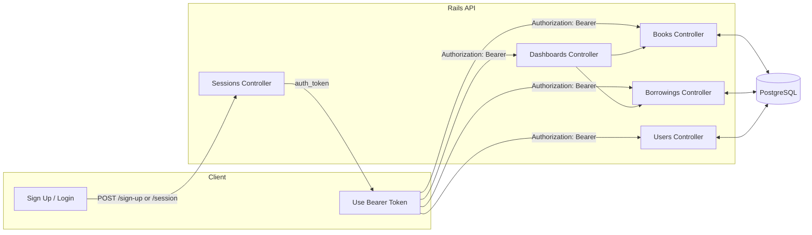
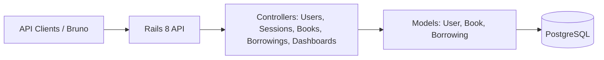
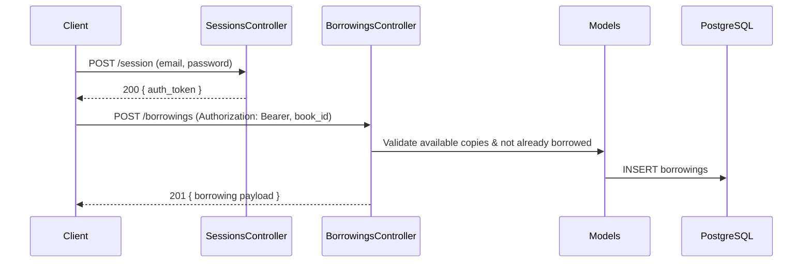

# Ballast Lane Test – Rails API

A Rails 8 API-only application for a simple library system. It supports users (members and librarians), session-based token auth (Bearer tokens), books CRUD, borrowing/return flows, and role-based dashboards.

## Tech stack
- Ruby 3.4.x, Rails 8 (API-only)
- PostgreSQL, Puma, Rack 3
- Auth: token via `Authorization: Bearer <token>`

## Quick start (macOS)
1) Prerequisites
- Ruby 3.4.x (rbenv/rvm)
- PostgreSQL running locally, you can use the following command:

```sh
docker run --rm -it \
  -p 5432:5432 \
  --name test_postgres \
  -e POSTGRES_PASSWORD=test \
  postgres:latest
```

2) Install dependencies
- bundle install

3) Database setup
- bin/rails db:prepare
- Load seed data using fixtures into development:
  - RAILS_ENV=development bin/rails db:fixtures:load

PostgreSQL setup (local or Docker):
- Local: update `config/database.yml` to match your local credentials (user, password, host/port).

Then point `config/database.yml` to host `localhost` (or `127.0.0.1`), user `postgres`, and password `test`.

4) Run the server
  - `bin/rails s` or `rails server`

5) Run tests
  - `bin/rails test` or `rails test`

## Default users (from fixtures)
- Librarian: librarian1@library.com / password
- Member:    member1@example.com / password

## Authentication
- Sign up: `POST /sign-up` (returns `auth_token`)
- Log in:  `POST /session` (returns `auth_token`)
- Log out: `DELETE /session`
- Send `Authorization: Bearer <token>` on subsequent requests

## Key endpoints
- Books: 
  - `GET /books`
  - `GET /books/:id`
  - `POST /books`
  - `PATCH/PUT /books/:id`
  - `DELETE /books/:id`
  - Requires auth. Create/Update/Delete require librarian role.
- Users: 
  - `GET /users`
  - `GET /users/:id`
  - `PATCH/PUT /users/:id`
  - `DELETE /users/:id`
  - Sign up via `POST /sign-up` (no auth). Others require auth.
- Borrowings: 
  - `POST /borrowings` (member only)
  - `GET /borrowings/:id`
  - `POST /borrowings/:id/retur` (librarian only)
- Dashboards: 
  - `GET /dashboard/librarian` (librarian)
  - `GET /dashboard/member` (member)

## Bruno API collection
A Bruno collection is included in `bruno/` with a `local` environment.
- Set `{{url}}` and use the `session/login` request to obtain a token.
- Use librarian login for book admin and returns, member login for borrowing.

## Diagrams

### High-level flow


### Components


### Sequence: Member borrows a book


## Notes
- Status 422 is named 'Unprocessable Content' per RFC 9110; use `status: :unprocessable_content`.
- All non-sign-up endpoints require authentication; librarian-only endpoints are enforced server-side.

## Troubleshooting
- Ensure Postgres is running and `config/database.yml` is correct.
- If fixtures don't load: confirm `test/fixtures/` exists and run with `RAILS_ENV=development`.
- Logs: `log/development.log`.
